# Diagnosis key analysis (dka)

_[Deutsche Fassung](README.md)_

Statistical analysis of the daily diagnosis keys of the official German COVID-19 tracing app ([Corona-Warn-App](https://github.com/corona-warn-app)). The daily dumps of the diagnosis keys are being analyzed by the [diagnosis-keys](https://github.com/mh-/diagnosis-keys) toolset by [mh-](https://github.com/mh-/). These data can only be [estimated](https://github.com/mh-/diagnosis-keys/blob/master/doc/algorithm.md), due to the decentralized architecture of the tracing app. Hence, all information are without any guarantee. All diagrams in this repository are licensed under [CC BY-NC-SA](https://creativecommons.org/licenses/by-nc-sa/3.0/). See [coronawarn.app](https://www.coronawarn.app) for more information about the COVID-19 tracing app for Germany.

**Link to website with diagrams: [https://micb25.github.io/dka/](https://micb25.github.io/dka/index_en.html)**

An alternative dashboard of [janpf](https://github.com/janpf) can be found at: [https://ctt.pfstr.de/](https://ctt.pfstr.de/) ([GitHub](https://github.com/janpf/ctt))

## Diagrams 
### Usage of the Corona-Warn-App ([RKI](https://www.rki.de/DE/Content/InfAZ/N/Neuartiges_Coronavirus/WarnApp/Warn_App.html))
downloads                                  | issued teleTANs
:-----------------------------------------:|:-----------------------------------------:
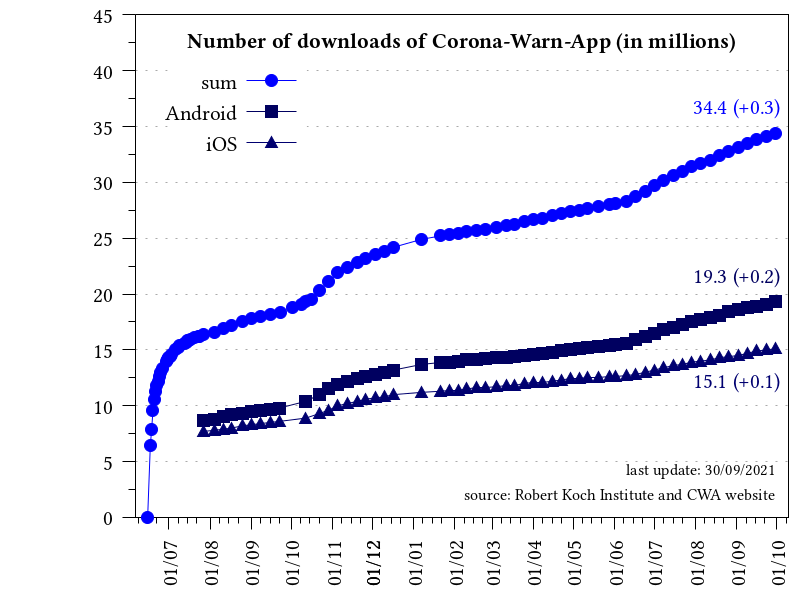       | 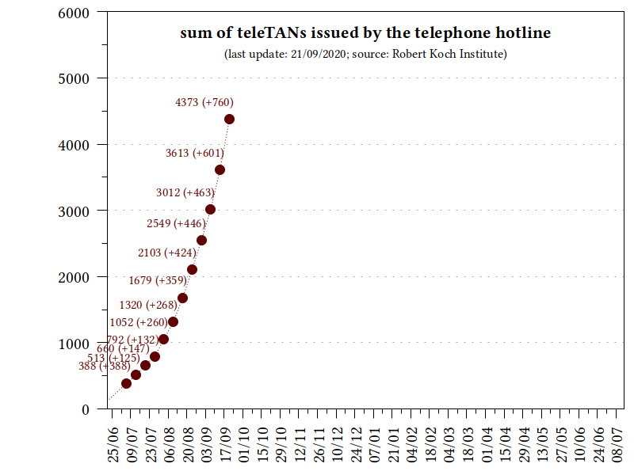 

### Positively tested people sharing their diagnosis keys ([estimates](https://github.com/mh-/diagnosis-keys/blob/master/doc/algorithm.md))
per day                                    | per week
:-----------------------------------------:|:-----------------------------------------:
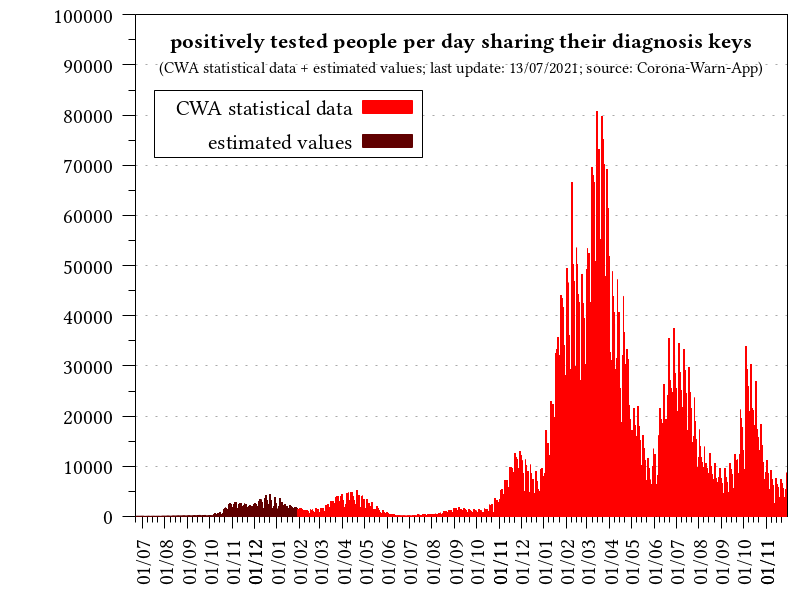           | 
**per day (7-day average)**                | **sum**
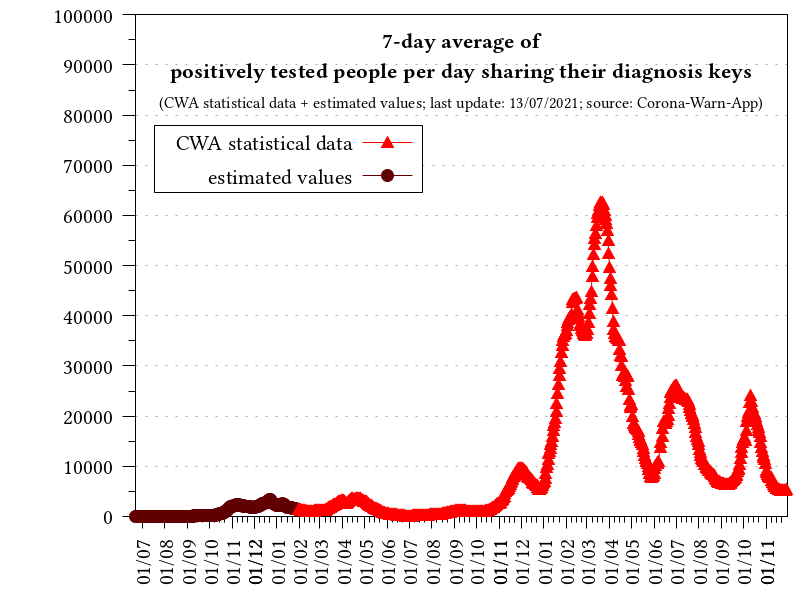        | 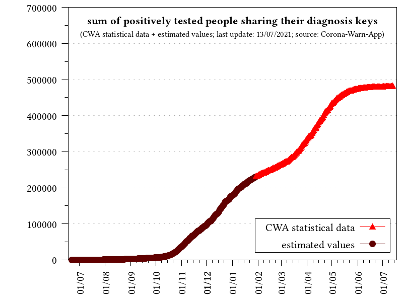

### Correlation with German COVID-19 data of the [Robert Koch Institute](https://corona.rki.de/) (RKI)
ratio                                      | ratio (7-day average)
:-----------------------------------------:|:-----------------------------------------:
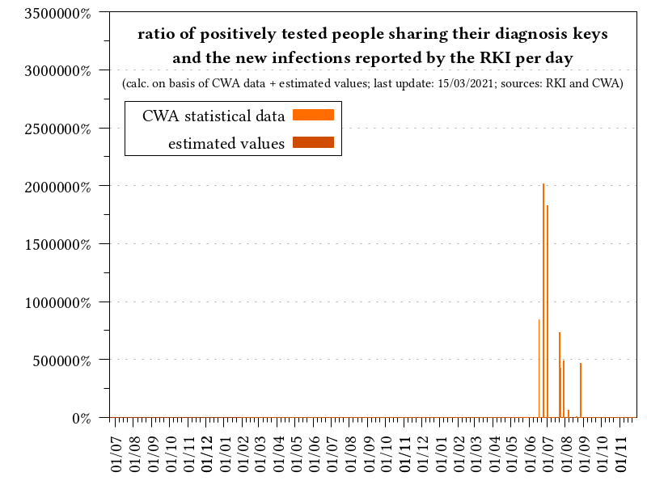       | 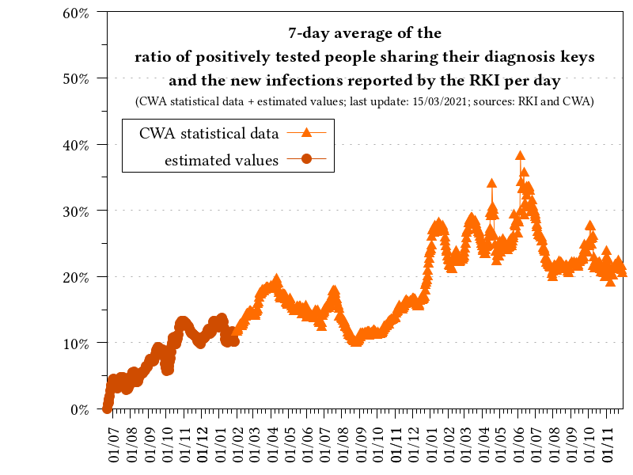
**reported new infections**                | **reported new infections (per week)**
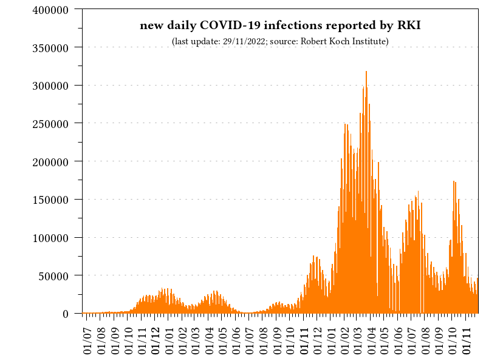           | 

### Correlation with German COVID-19 data of the [Johns Hopkins University](https://www.arcgis.com/apps/opsdashboard/index.html#/bda7594740fd40299423467b48e9ecf6) (JHU)
ratio                                      | ratio (7-day average)
:-----------------------------------------:|:-----------------------------------------:
       | 
**reported new infections**                |    
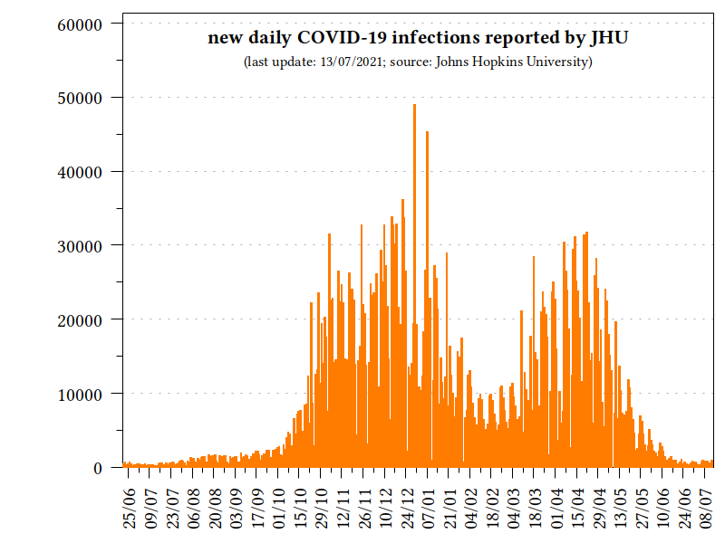           | 

### Shared legitimate diagnosis keys of positively tested people ([estimates](https://github.com/mh-/diagnosis-keys/blob/master/doc/algorithm.md))
per day                                    | sum
:-----------------------------------------:|:-----------------------------------------:
 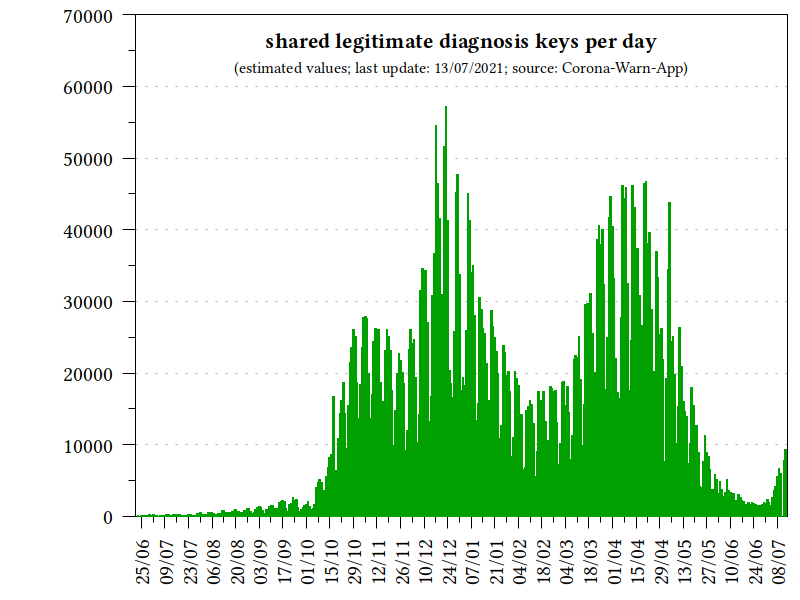 | 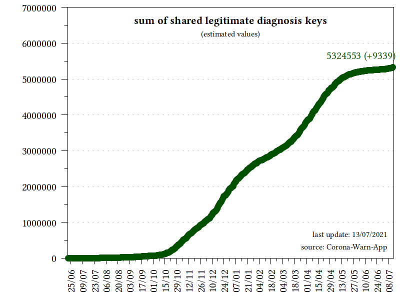

### Distributed diagnosis keys
per day                                    | sum
:-----------------------------------------:|:-----------------------------------------:
 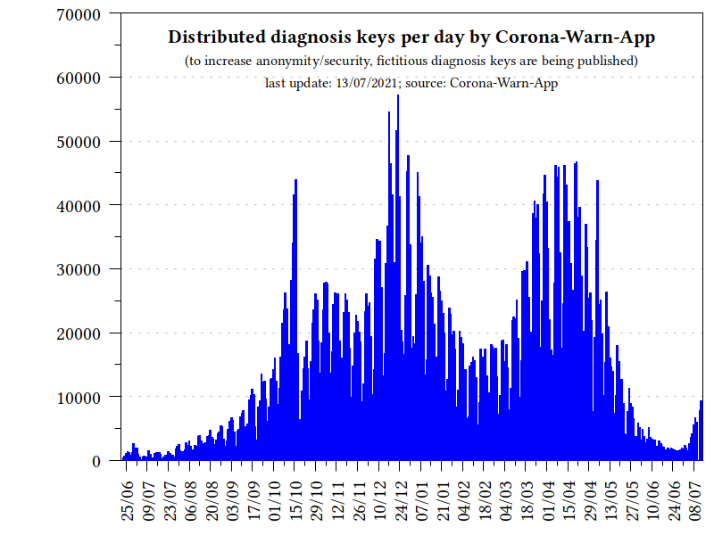               | 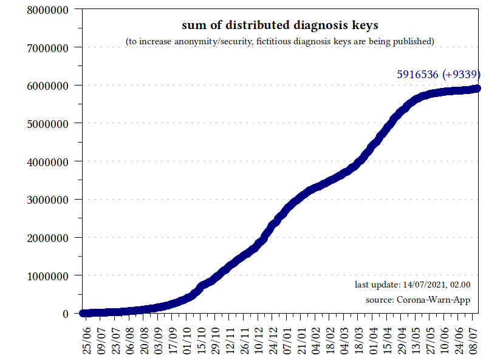
                                           |    
 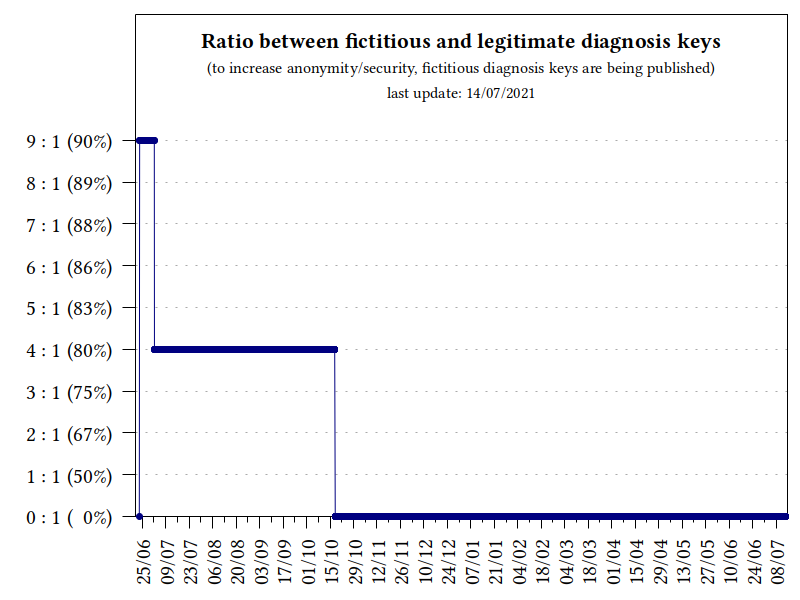 |  
 
### Distribution of the transmission risk level (TRL) in the diagnosis keys
sum                                        |    
:-----------------------------------------:|:-----------------------------------------:
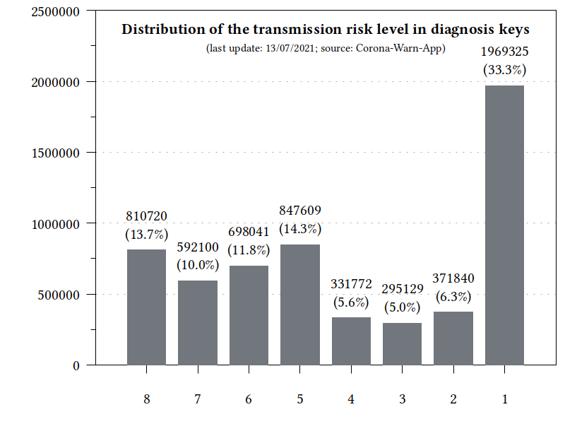       | 
