# Diagnosis Key Analysis (dka)

Statistische Analyse der täglichen Diagnoseschlüssel der offiziellen deutschen COVID-19 Tracing-App ([Corona-Warn-App](https://github.com/corona-warn-app)). Zur Auswertung der täglichen Dumps der Diagnoseschlüssel wird das [diagnosis-keys](https://github.com/mh-/diagnosis-keys)-Toolset von [mh-](https://github.com/mh-/) verwendet. Aufgrund der dezentralen Architektur der Corona-Warn-App können die analysierten Daten nur abgeschätzt werden. Daher sind alle Angaben ohne Gewähr. Die Diagramme in diesem Repository sind lizensiert unter [CC BY-NC-SA](https://creativecommons.org/licenses/by-nc-sa/3.0/de/). Mehr Informationen zur COVID-19 Tracing App für Deutschland unter [coronawarn.app](https://www.coronawarn.app).

**Link zur Seite mit Diagrammen: [https://micb25.github.io/dka/](https://micb25.github.io/dka/)**

Alternatives Dashboard von [janpf](https://github.com/janpf): [https://ctt.pfstr.de/](https://ctt.pfstr.de/) ([GitHub](https://github.com/janpf/ctt))

## Diagramme 
### Positiv getestete Personen, die Diagnoseschlüssel teilten (geschätzt)
Täglich                           |  Summe
:--------------------------------:|:----------------------------------:
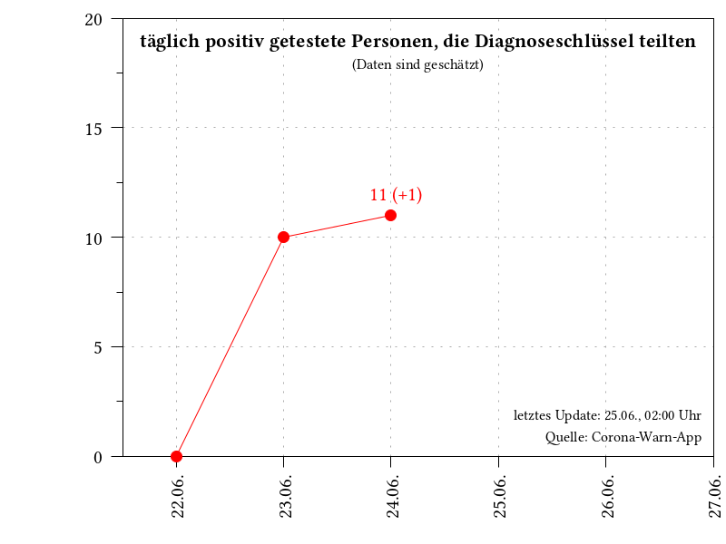           |  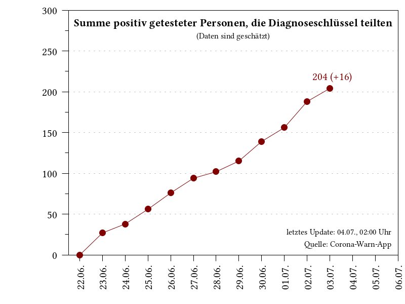

### Korrelation mit RKI-Daten
gemeldete Neuinfektionen          | Verhältnis
:--------------------------------:|:----------------------------------:
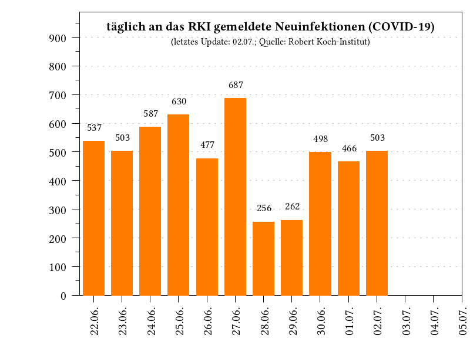           |  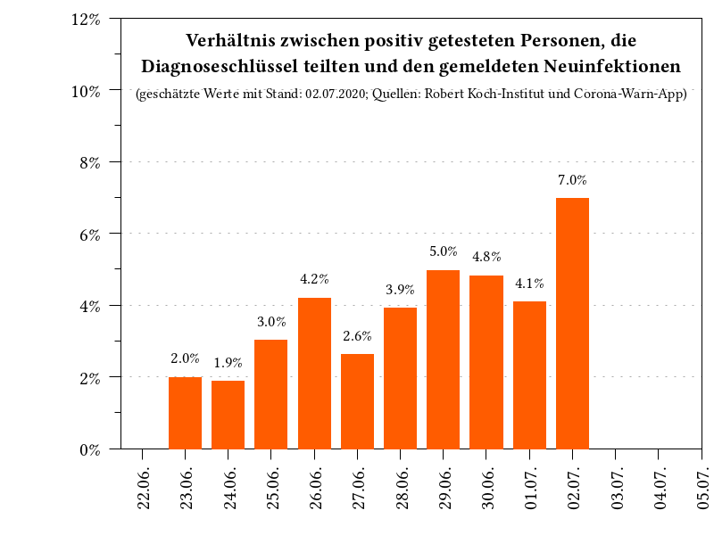

### Geteilte Diagnoseschlüssel von positiv getesteten Personen (geschätzt)
Täglich                           |  Summe
:--------------------------------:|:----------------------------------:
 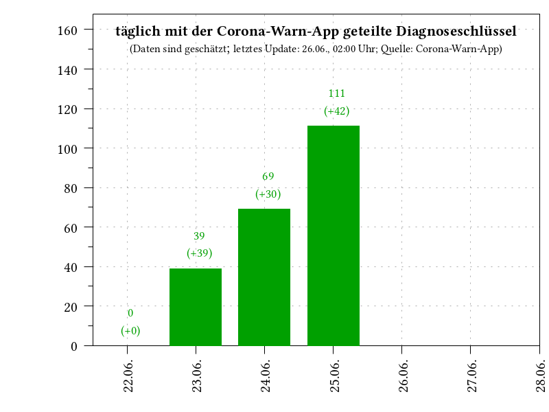 |  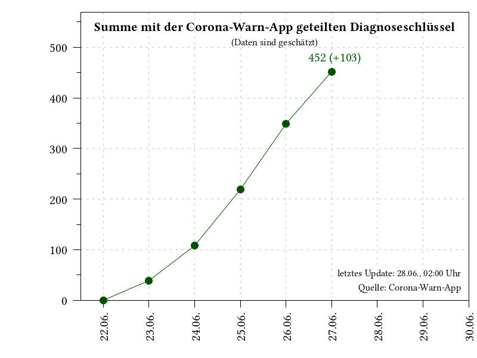

### Diagnoseschlüssel
Täglich                           |  Summe
:--------------------------------:|:----------------------------------:
 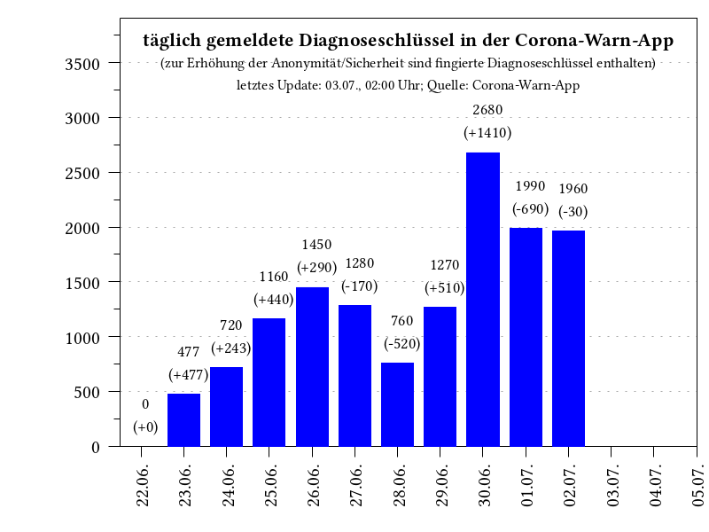               |  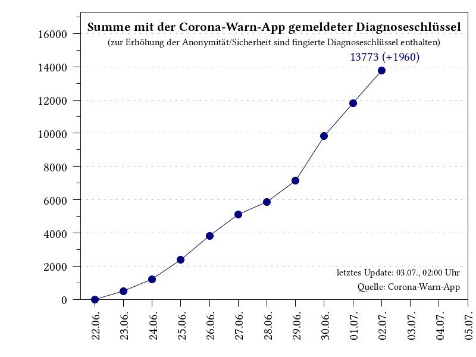
 
### Verteilung Transmission Risk Level in Diagnoseschlüsseln
Absolut                           |  Relativ
:--------------------------------:|:----------------------------------:
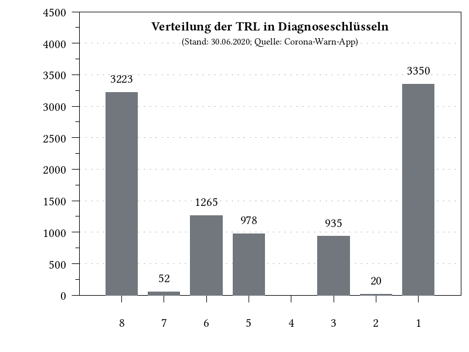       | 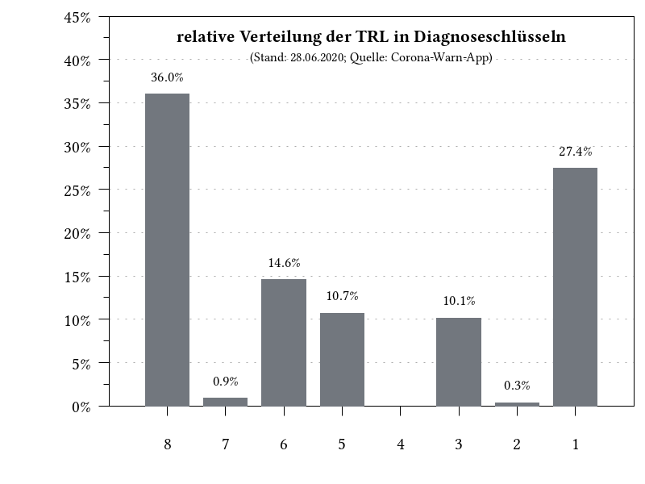

### Verbreitung der Corona-Warn-App
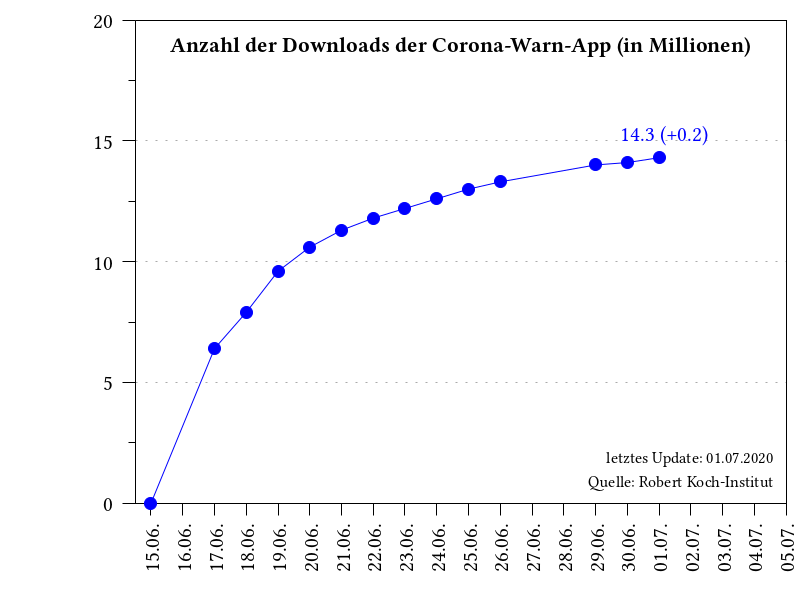

## Erläuterungen

### Transmission Risk Level
Entscheidet sich eine Person im Falle einer positiven Testung zur Übertragung seiner Tagesschlüssel (max. 14 Stück), so wird diesen ein variierender Wert für das Übertragungsrisiko hinzugefügt (Wertebereich: 1-8; engl. Transmission Risk Level), welches dem folgenden Schema folgt und vom Robert Koch-Institut festgelegt wurde. Je höher der entsprechende Wert ist, desto höher wird ein entsprechendes Infektionsrisiko bei einem Kontakt angenommen. Zur Verbesserung der Anonymität enthalten die täglichen Pakete mit gemeldeten Diagnoseschlüssel, auch eine große Zahl fingierter Schlüssel. Die Anzahl an Personen, welche ihre Tagesschlüssel geteilt haben um die Kontaktpersonen zu warnen, kann aber mit Hilfe dieses speziellen Schemas abgeschätzt werden.

Tage seit Krankmeldung   | Übermitteltes TRL
:-----------------------:|:------------------:
0                        | 5
1                        | 6
2                        | 8
3                        | 8
4                        | 8
5                        | 5
6                        | 3
7-13                     | 1
