# Diagnosis Key Analysis (dka)

_[English version](README.en.md)_

Statistische Analyse der täglichen Diagnoseschlüssel der offiziellen deutschen COVID-19 Tracing-App ([Corona-Warn-App](https://github.com/corona-warn-app)). Zur Auswertung der täglichen Dumps der Diagnoseschlüssel wird das [diagnosis-keys](https://github.com/mh-/diagnosis-keys)-Toolset von [mh-](https://github.com/mh-/) verwendet. Aufgrund der dezentralen Architektur der Corona-Warn-App können die analysierten Daten nur [abgeschätzt](https://github.com/mh-/diagnosis-keys/blob/master/doc/algorithm.md) werden. Daher sind alle Angaben ohne Gewähr. Die Diagramme in diesem Repository sind lizensiert unter [CC BY-NC-SA](https://creativecommons.org/licenses/by-nc-sa/3.0/de/). Mehr Informationen zur COVID-19 Tracing App für Deutschland unter [coronawarn.app](https://www.coronawarn.app).

**Link zur Seite mit Diagrammen: [https://micb25.github.io/dka/](https://micb25.github.io/dka/)**

Alternatives Dashboard von [janpf](https://github.com/janpf): [https://ctt.pfstr.de/](https://ctt.pfstr.de/) ([GitHub](https://github.com/janpf/ctt))

## Diagramme 
### Verwendung der Corona-Warn-App ([RKI](https://www.rki.de/DE/Content/InfAZ/N/Neuartiges_Coronavirus/WarnApp/Warn_App.html))
Downloads                                  | ausgestellte teleTANs
:-----------------------------------------:|:-----------------------------------------:
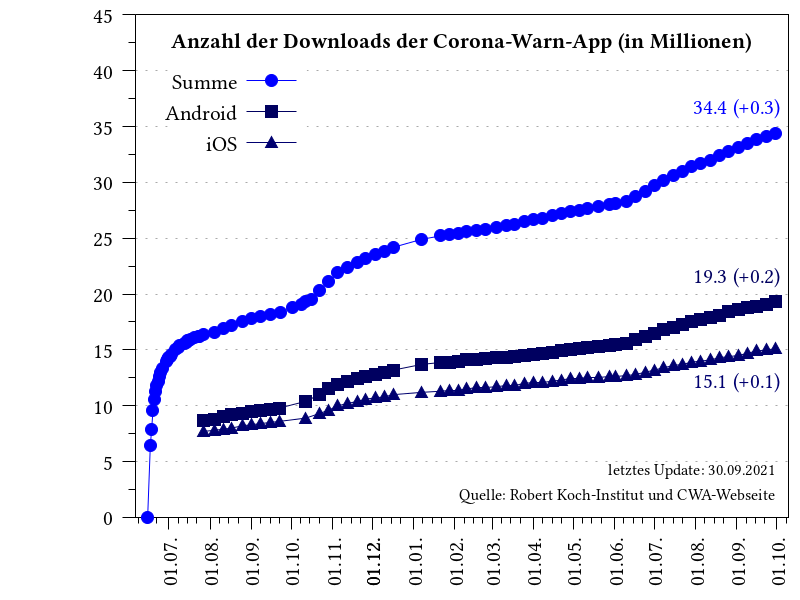       | 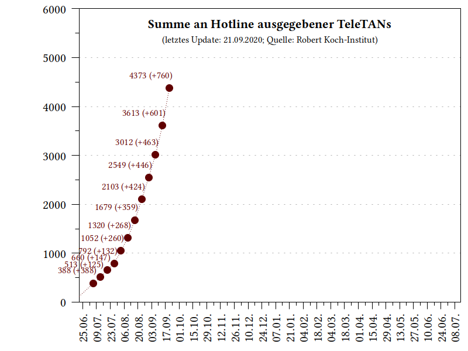 

### Positiv getestete Personen, die Diagnoseschlüssel teilten ([geschätzt](https://github.com/mh-/diagnosis-keys/blob/master/doc/algorithm.md))
Täglich                                    | Wöchentlich
:-----------------------------------------:|:-----------------------------------------:
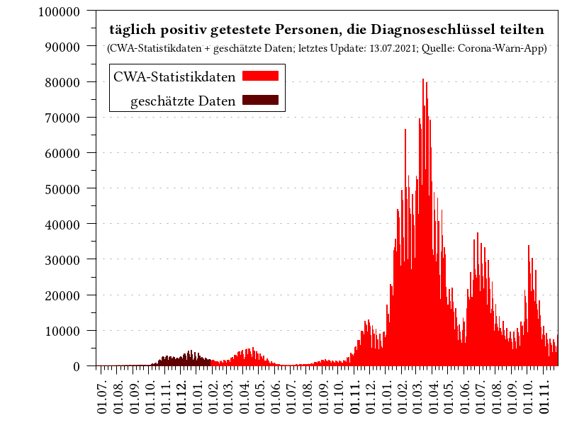           | 
**Täglich (7-Tage-Mittelwert)**            | **Summe**   
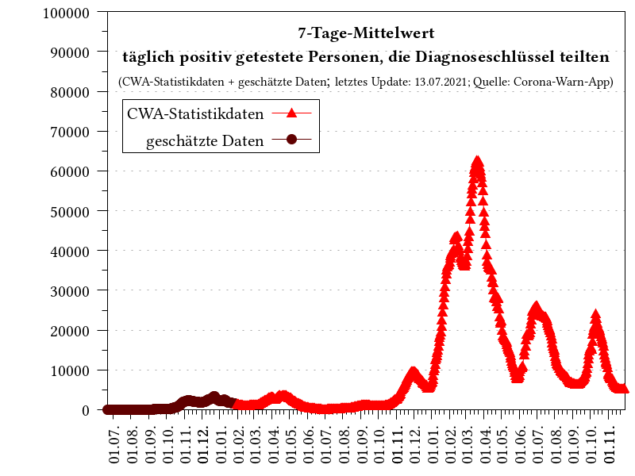        | 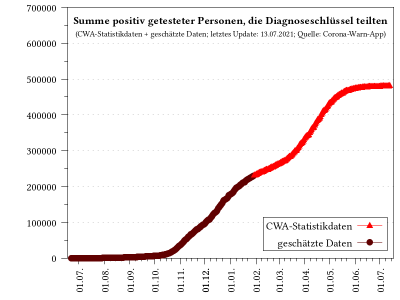

### Korrelation mit Daten des [Robert Koch-Instituts](https://corona.rki.de/) (RKI)
Verhältnis                                 | Verhältnis (7-Tage-Mittelwert)
:-----------------------------------------:|:-----------------------------------------:
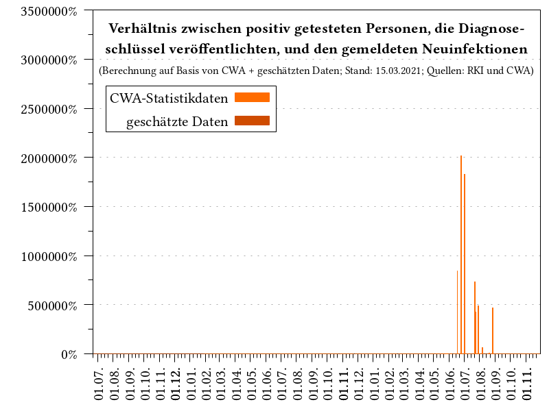       | 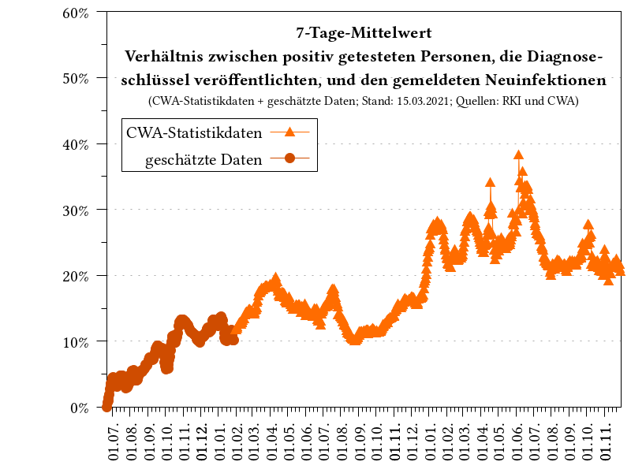
**Verhältnis (nach Kalenderwoche)**        | **gemeldete Neuinfektionen (pro KW)**
    | 
**gemeldete Neuinfektionen**               |  
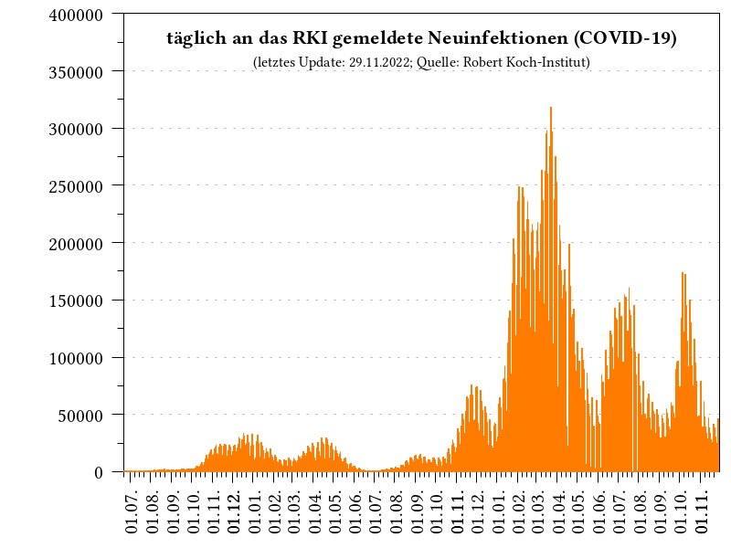           | 

### Korrelation mit Daten der [Johns Hopkins Universität](https://www.arcgis.com/apps/opsdashboard/index.html#/bda7594740fd40299423467b48e9ecf6) (JHU)
Verhältnis                                 | Verhältnis (7-Tage-Mittelwert)
:-----------------------------------------:|:-----------------------------------------:
       | 
**gemeldete Neuinfektionen**               |    
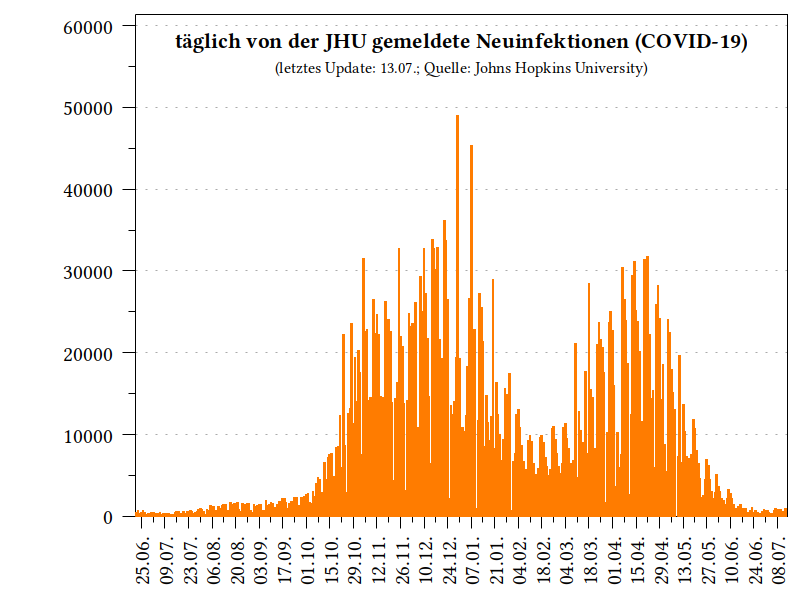           | 

### Geteilte Diagnoseschlüssel von positiv getesteten Personen ([geschätzt](https://github.com/mh-/diagnosis-keys/blob/master/doc/algorithm.md))
Täglich                                    |  Summe
:-----------------------------------------:|:-----------------------------------------:
 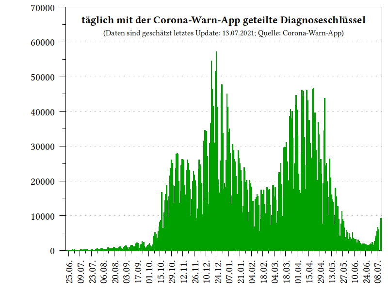 | 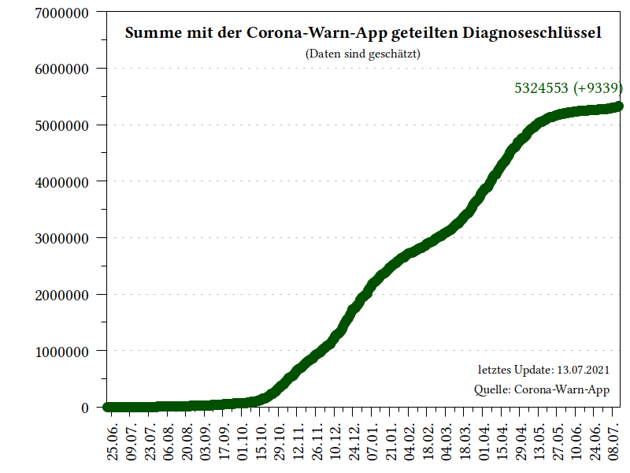

### Diagnoseschlüssel
Täglich                                    |  Summe
:-----------------------------------------:|:-----------------------------------------:
 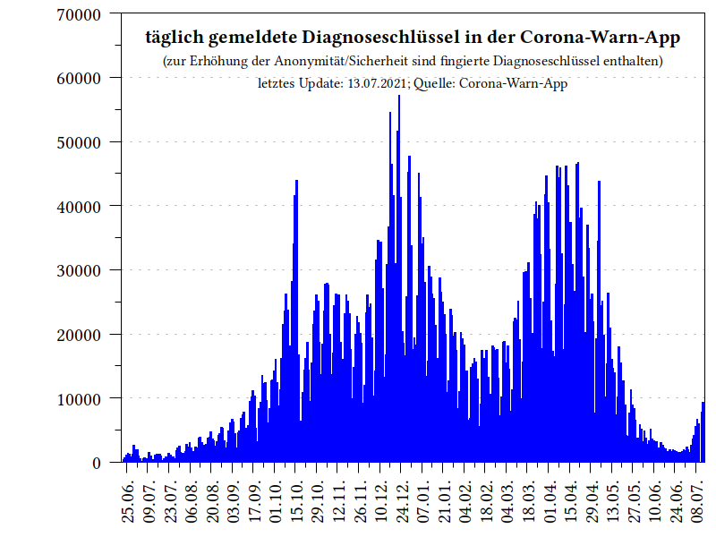               | 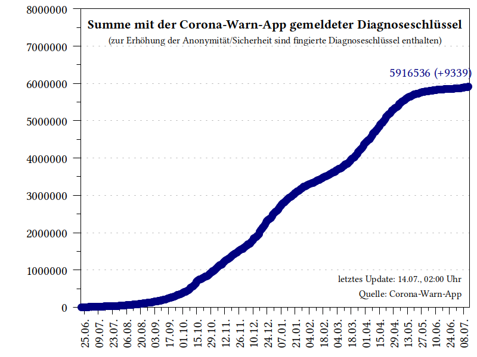
                                           |    
 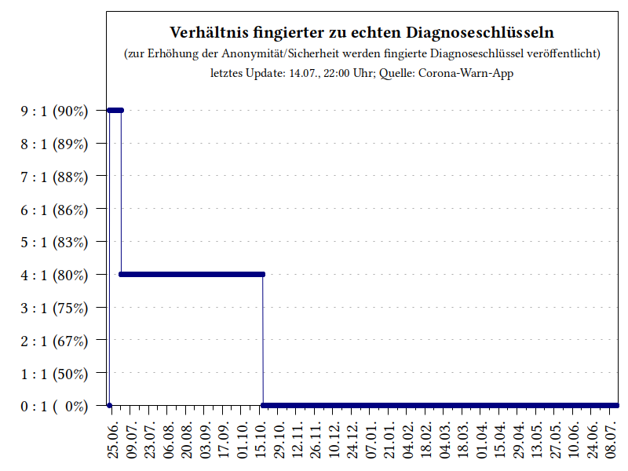 |  
 
### Verteilung Transmission Risk Level (TRL) in Diagnoseschlüsseln
Summe                                      |    
:-----------------------------------------:|:-----------------------------------------:
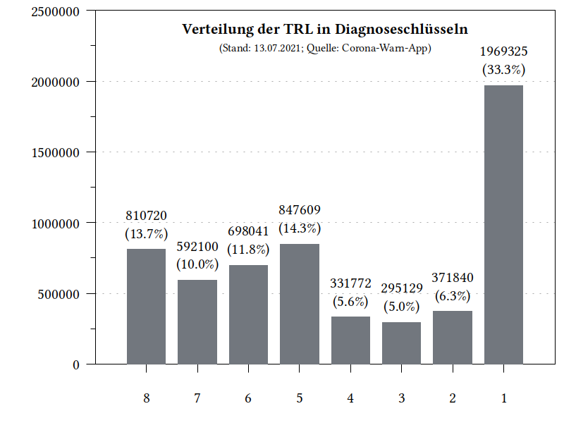       | 

## Erläuterungen

### Transmission Risk Level
Entscheidet sich eine Person im Falle einer positiven Testung zur Übertragung seiner Tagesschlüssel (max. 13 Stück), so wird diesen ein variierender Wert für das Übertragungsrisiko hinzugefügt (Wertebereich: 1-8; engl. Transmission Risk Level), welches dem folgenden Schema folgt und vom Robert Koch-Institut festgelegt wurde. Je höher der entsprechende Wert ist, desto höher wird ein entsprechendes Infektionsrisiko bei einem Kontakt angenommen. Zur Verbesserung der Anonymität enthalten die täglichen Pakete mit gemeldeten Diagnoseschlüssel, auch eine große Zahl fingierter Schlüssel. Die Anzahl an Personen, welche ihre Tagesschlüssel geteilt haben um die Kontaktpersonen zu warnen, kann aber mit Hilfe dieses speziellen Schemas [abgeschätzt](https://github.com/mh-/diagnosis-keys/blob/master/doc/algorithm.md) werden.

Tage seit Meldung        | Übermittelter TRL-Wert | Kommentar
:-----------------------:|:----------------------:|:------------------:
0                        | 5                      | wird nicht übermittelt
1                        | 6
2                        | 8
3                        | 8
4                        | 8
5                        | 5
6                        | 3
7-13                     | 1
